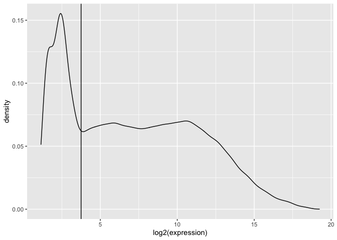
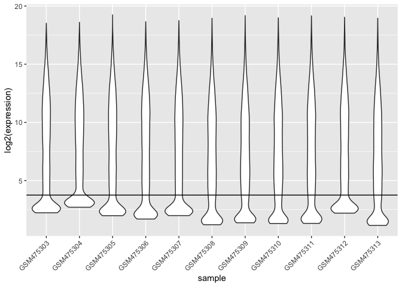
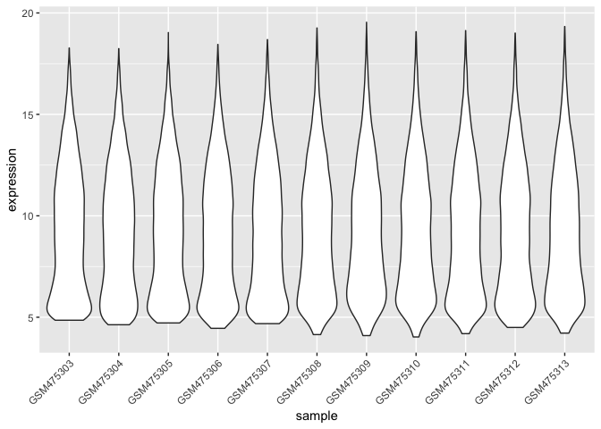
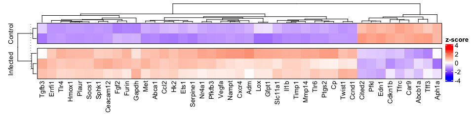
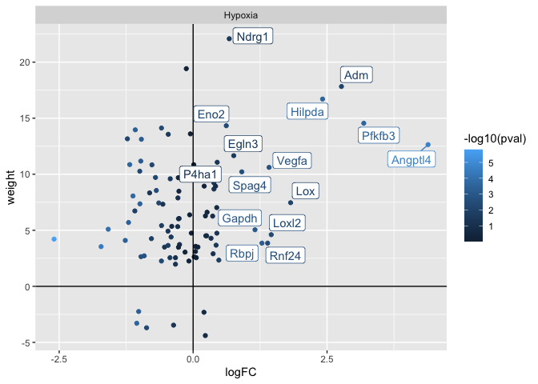
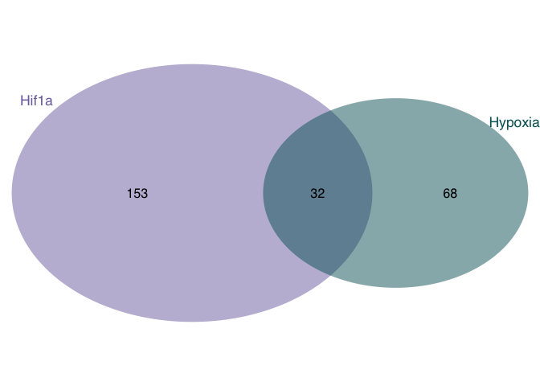

HIF1A response to salmonella infection
================
Christian H. Holland[1]

# Libraries and sources

These libraries are required for this analysis.

``` r
library(tidyverse)
library(GEOquery)
library(limma)
library(biobroom)
library(VennDiagram)
library(AachenColorPalette) # remotes::install_github("christianholland/AachenColorPalette")
library(cowplot)
library(msigdbr)
library(dorothea)
library(progeny)
library(ggpubr)
library(ggrepel)
library(viper)
library(vsn)
library(ComplexHeatmap)
```

# Data preprocessing

First we download the processed data from Gene Expression Omnibus with
the accession ID GSE19174.

``` r
# load processed data from GEO
eset = getGEO("GSE19174", GSEMatrix = TRUE, AnnotGPL = TRUE)[[1]]

eset
```

    ## ExpressionSet (storageMode: lockedEnvironment)
    ## assayData: 45018 features, 11 samples 
    ##   element names: exprs 
    ## protocolData: none
    ## phenoData
    ##   sampleNames: GSM475303 GSM475304 ... GSM475313 (11 total)
    ##   varLabels: title geo_accession ... treatment:ch1 (40 total)
    ##   varMetadata: labelDescription
    ## featureData
    ##   featureNames: 1 2 ... 45220 (45018 total)
    ##   fvarLabels: ID Gene title ... Platform_SEQUENCE (22 total)
    ##   fvarMetadata: Column Description labelDescription
    ## experimentData: use 'experimentData(object)'
    ##   pubMedIds: 20515923 
    ## Annotation: GPL4134

From the pheno data of the expression set we can extract the relevant
meta data. As we focus only on the genotype “wildtype”, samples related
to PARP1 knockout and corresponding controls are discarded.

``` r
# extract meta data
meta = pData(eset) %>%
  as_tibble() %>%
  select(sample = geo_accession,
         genotype = `genotype:ch1`,
         time = `infection duration:ch1`,
         treatment = `treatment:ch1`) %>%
  mutate(genotype = as_factor(str_remove(genotype, "PARP1 ")),
         time = ordered(parse_number(time)),
         treatment = case_when(str_detect(treatment, "SB300") ~ "salmonella",
                               str_detect(treatment, "SB161") ~ "control"),
         treatment = as_factor(treatment)) %>%
  # subset meta data to relevant samples
  filter(time == 10)

meta
```

    ## # A tibble: 5 x 4
    ##   sample    genotype time  treatment 
    ##   <chr>     <fct>    <ord> <fct>     
    ## 1 GSM475303 wildtype 10    salmonella
    ## 2 GSM475304 wildtype 10    salmonella
    ## 3 GSM475305 wildtype 10    salmonella
    ## 4 GSM475306 wildtype 10    control   
    ## 5 GSM475307 wildtype 10    control

From GEO it is not clear if the processed data are already normalized.
Based on the violins it seems that the data have not been normalized nor
filtered for lowly expressed genes. Hence, we have to perfrom these
steps on our own

``` r
# plot log2 probe intensities distribution for the entire data set and per 
# sample
tidy_eset = exprs(eset) %>%
  as.data.frame() %>%
  gather(sample, expression) %>%
  as_tibble()


tidy_eset %>%
  ggplot(aes(x=log2(expression))) +
  geom_density() +
  geom_vline(xintercept = 3.75)
```

<!-- -->

``` r
tidy_eset %>%
  ggplot(aes(x=sample, y=log2(expression))) +
  geom_violin() +
  theme(axis.text.x = element_text(angle = 45, hjust = 1)) +
  geom_hline(yintercept = 3.75)
```

<!-- -->

# Filter out lowly expressed probes

Here we filter out lowly expressed probes whose intensity is below an
empirical determined cutoff

``` r
# discard genes with an average intensity below 2**3.75
keep=apply(exprs(eset), 1, function(row) {mean(row) >= 3.75 ** 2})
eset_filtered = eset[keep,]

tidy_eset_filtered = exprs(eset_filtered) %>%
  as.data.frame() %>%
  gather(sample, expression) %>%
  as_tibble()

tidy_eset_filtered %>%
  ggplot(aes(x=sample, y=log2(expression))) +
  geom_violin() +
  theme(axis.text.x = element_text(angle = 45, hjust = 1))
```

<!-- -->

# Normalization

Here we normalize the filtered expression set with vsn. This includes
log2 transformation of the data.

``` r
norm_expr = justvsn(exprs(eset_filtered))

tidy_norm_expr = norm_expr %>%
  as.data.frame() %>%
  gather(sample, expression) %>%
  as_tibble()

tidy_norm_expr %>%
  ggplot(aes(x=sample, y=expression)) +
  geom_violin() +
  theme(axis.text.x = element_text(angle = 45, hjust = 1))
```

<!-- -->

# Annotation

In the following steps we annotate the rownames with gene symbols and
finally average the expression for each individual gene symbol. Empty
strings or NA’s present in rownames are removed (if available).

``` r
mat = norm_expr

# add gene symbol as rownames
rownames(mat) = fData(eset_filtered)$`Gene symbol`

# summarize expression data per gene symbols
expr = limma::avereps(mat[!is.na(rownames(mat)),])

# check whether these is an NA or an emptry string in rownames
sum(is.na(rownames(expr)))
```

    ## [1] 0

``` r
sum(rownames(expr) == "")
```

    ## [1] 1

``` r
# remove emptry string
expr = expr[rownames(expr) != "",]

# subset expression matrix to relevant samples
expr = expr[,meta$sample]

expr %>%
  data.frame(check.names = F) %>%
  rownames_to_column("gene") %>%
  as_tibble()
```

    ## # A tibble: 16,305 x 6
    ##    gene          GSM475303 GSM475304 GSM475305 GSM475306 GSM475307
    ##    <chr>             <dbl>     <dbl>     <dbl>     <dbl>     <dbl>
    ##  1 Nppa               5.57      5.96      5.75      5.66      5.72
    ##  2 Aqp7               5.29      5.09      5.81      5.39      4.87
    ##  3 Gm12689            5.44      5.69      5.20      5.37      6.67
    ##  4 Hvcn1              8.80      8.22      8.33      8.97      8.43
    ##  5 A330106F07Rik      5.27      5.40      5.54      5.23      5.63
    ##  6 Ptdss2             9.16      9.06      9.28     10.7      10.3 
    ##  7 Itfg1              8.24      8.54      8.45      8.82      8.86
    ##  8 Elmo1              7.39      7.16      7.03      7.10      7.05
    ##  9 Crtac1             7.84      8.27      8.03      7.36      8.02
    ## 10 Pnpt1             11.5      10.7      10.7      10.4       9.58
    ## # … with 16,295 more rows

# Differential gene expression analysis

Here we perform differential gene expression analysis between samples
treated with Salmonella and corresponding controls. As a cutoff for
differential expressed genes we assume an effect size of at least 1 and
fdr &lt;= 0.05. These cutoffs are variable.

``` r
# differential gene expression analysis
design = model.matrix(~0+treatment, meta)
rownames(design) = meta$sample
colnames(design) = levels(meta$treatment)

# define contrasts
contrasts = makeContrasts(
  salm_vs_ctrl = salmonella - control,
  levels = design
)

limma_result = lmFit(expr, design) %>%
  contrasts.fit(contrasts) %>%
  eBayes() %>%
  tidy() %>%
  select(gene, contrast = term, logFC = estimate, statistic = statistic, 
             pval = p.value) %>%
  group_by(contrast) %>% 
  mutate(fdr = p.adjust(pval, method = "BH")) %>%
  ungroup()

effect_size_cutoff = 1
fdr_cutoff = 0.05

degs = limma_result %>%
  mutate(regulation = case_when(
    logFC >= effect_size_cutoff & fdr <= fdr_cutoff ~ "up",
    logFC <= -effect_size_cutoff & fdr <= fdr_cutoff ~ "down",
    TRUE ~ "ns")
    ) %>%
  mutate(regulation = factor(regulation, levels = c("up", "down", "ns"))) %>%
  arrange(pval)
```

These are the top differentially expressed genes:

    ## # A tibble: 16,305 x 7
    ##    gene   contrast     logFC statistic         pval      fdr regulation
    ##    <chr>  <fct>        <dbl>     <dbl>        <dbl>    <dbl> <fct>     
    ##  1 Tead4  salm_vs_ctrl  5.62      40.7 0.0000000125 0.000179 up        
    ##  2 Sprr2h salm_vs_ctrl  8.99      37.1 0.0000000220 0.000179 up        
    ##  3 Il33   salm_vs_ctrl  6.05      31.4 0.0000000597 0.000212 up        
    ##  4 Edn2   salm_vs_ctrl -4.35     -29.3 0.0000000904 0.000212 down      
    ##  5 Hdc    salm_vs_ctrl  6.70      29.2 0.0000000925 0.000212 up        
    ##  6 Pbld1  salm_vs_ctrl -4.06     -27.8 0.000000124  0.000212 down      
    ##  7 Lcn2   salm_vs_ctrl  4.19      27.6 0.000000130  0.000212 up        
    ##  8 Ephx3  salm_vs_ctrl  6.64      27.4 0.000000137  0.000212 up        
    ##  9 Cxcl9  salm_vs_ctrl  8.45      27.0 0.000000148  0.000212 up        
    ## 10 Iigp1  salm_vs_ctrl  7.20      26.7 0.000000160  0.000212 up        
    ## # … with 16,295 more rows

Based on the volcano plot the salmonella infection induces massive
changes in gene expression. Even though the activity of a TF is a much
more robust estimation of its actual biological state than the
expression, it is still worth to check the expression of Hif1a. We find
the gene Hif1a strongly (and significantly) upregulated.

``` r
# volcano plot
degs %>%
  ggplot(aes(x=logFC, y=-log10(pval), color=regulation, alpha = regulation)) +
  geom_point() +
  labs(x="logFC", y=expression(-log['10']*"(p-value)")) +
  scale_color_manual(values = aachen_color(c("green", "blue", "black50")), 
                     drop = F) +
  scale_alpha_manual(values = c(0.7,0.7,0.2), guide ="none", drop=F)
```

<!-- -->

``` r
# Number of deferentially expressed genes
degs %>% count(regulation)
```

    ## # A tibble: 3 x 2
    ##   regulation     n
    ##   <fct>      <int>
    ## 1 up          1641
    ## 2 down        1652
    ## 3 ns         13012

``` r
degs %>%
  filter(gene == "Hif1a")
```

    ## # A tibble: 1 x 7
    ##   gene  contrast     logFC statistic      pval      fdr regulation
    ##   <chr> <fct>        <dbl>     <dbl>     <dbl>    <dbl> <fct>     
    ## 1 Hif1a salm_vs_ctrl  2.97      12.6 0.0000143 0.000659 up

# Regulon comparison

As regulon resource for Hif1a we can either use DoRothEA or a gene sets
from MSigDB. Here we check the overlap of target genes between these two
resources. We see a reasonable overlap between both resources, however
DoRothEA lists much more putative target genes. Hence, we believe it is
better to continue the analysis with the regulons from DoRothEA.

``` r
# show targets of Hif1a in volcano plot
dorothea_hif1a = dorothea::dorothea_mm %>%
  filter(tf == "Hif1a") %>%
  distinct(gene = target, mor)

msigdb_hif1a = msigdbr(species = "Mus musculus", category = "C2", subcategory = "CGP") %>%
  filter(gs_name == "SEMENZA_HIF1_TARGETS") %>%
  distinct(gene = gene_symbol) %>%
  mutate(mor = 1)

# overlap of dorothea and msigdb regulons
grid.newpage()
draw.pairwise.venn(
  nrow(dorothea_hif1a), 
  nrow(msigdb_hif1a), 
  nrow(dplyr::intersect(dorothea_hif1a, msigdb_hif1a)),
  category = c("dorothea", "msigdb"),
  lty = "blank",
  cex = 1,
  fontfamily = rep("sans", 3),
  fill = aachen_color(c("purple", "petrol")),
  cat.col = aachen_color(c("purple", "petrol")),
  cat.cex = 1.1,
  cat.fontfamily = rep("sans", 2))
```

<!-- -->

    ## (polygon[GRID.polygon.324], polygon[GRID.polygon.325], polygon[GRID.polygon.326], polygon[GRID.polygon.327], text[GRID.text.328], text[GRID.text.329], lines[GRID.lines.330], text[GRID.text.331], text[GRID.text.332], text[GRID.text.333])

# Hif1a target expression

Here we check the expression of the target genes of Hif1a from DoRothEA
and MSigDB. Hif1a is supposed to activate the expression of almost all
its target genes but one (Ccnd1). Accordingly, we see that most of its
targets are positively upregulated. However, we also see several target
genes downregulated.

``` r
d = dorothea_hif1a %>%
  mutate(class = "dorothea")

m = msigdb_hif1a %>%
  mutate(class = "msigdb")

targets = bind_rows(d, m)

p = degs %>%
  mutate(label = ifelse(regulation != "ns", gene, NA_character_)) %>%
  inner_join(targets, by="gene") %>%
  filter(class == "dorothea") %>%
  ggplot(aes(x=logFC, y=-log10(pval), color=regulation, alpha = regulation)) +
  geom_point() +
  geom_label_repel(aes(label = label), size=3, show.legend = FALSE) +
  # facet_wrap(~class) +
  labs(x="logFC", y=expression(-log['10']*"(p-value)")) +
  scale_color_manual(values = aachen_color(c("green", "blue", "black50")), 
                     drop = F) +
  scale_alpha_manual(values = c(0.7,0.7,0.2), guide ="none", drop=F)

ggsave("volcano_plot.pdf", p, width = 4.5, height = 7.5)
```

    ## Warning: Removed 109 rows containing missing values (geom_label_repel).

``` r
# save data for volcano plot
degs %>%
  inner_join(targets, by="gene") %>%
  filter(class == "dorothea") %>%
  write_csv("hif1a_target_expression.csv")
```

``` r
d = dorothea_hif1a %>%
  mutate(class = "dorothea")

regulated_genes = degs %>% filter(regulation != "ns")

common_genes = intersect(d$gene, regulated_genes$gene)

# subset to hif1a target genes
mat = t(scale(t(expr[common_genes,])))

col_fun = circlize::colorRamp2(c(-3, 0, 3), c("blue", "white", "red"))

Heatmap(t(mat), col = col_fun, name = "z-score", 
        column_names_gp = gpar(fontsize = 10),
        row_split = c(rep("Infected",3), rep("Control", 2)), 
        show_row_names = F, border = T,
        row_gap = unit(2.5, "mm"), row_title_gp = gpar(fontsize=10))
```

<!-- -->

# TF activity inference

## Sample wise TF activity inference

Here we infer TF activities for each individual samples. We focus only
on TFs with confidence level A or B. Hif1a has confidence level A and
belongs thus to the regulons with the highest quality. Subsequently, we
estimate with a t-test whether we find Hif1a differentially activiated
in salmonella samples vs corresponding controls. We find Hif1a
significantly activated in salmonella treated samples in comparison to
the respective control. However, due to the low sample size (3
perturbation and 2 control samples) we lack statistical power and must
thus interpret this result with caution.

``` r
# run viper with dorothea on expression matrix
tf_scores = run_viper(expr, dorothea_mm, 
                      options = list(nes = T, method = "scale", minsize = 4, 
                                     eset.filter = F, verbose = F), tidy = T) %>%
  as_tibble()

# plot tf activity of Hif1a
tf_scores %>%
  filter(tf %in% c("Hif1a")) %>%
  left_join(meta, by="sample") %>%
  ggplot(aes(x=treatment, y=activity)) +
  geom_boxplot() +
  stat_compare_means(method = "t.test") +
  geom_point()
```

<!-- -->

``` r
# save hif1a activity
tf_scores %>%
  filter(tf %in% c("Hif1a")) %>%
  left_join(meta, by="sample") %>%
  write_csv("hif1_activity.csv")
```

## Inference of TF activity from contrast

Instead inferring the TF activity for each sample we can infer the TF
activity directly from the contrast. Again we focus only on TFs with
confidence level A or B

``` r
# convert dorothea regulons to required viper format
dorothea_ab = dorothea_mm %>% filter(confidence %in% c("A", "B"))
regulon_list = split(dorothea_ab, dorothea_ab$tf)

viper_regulons = lapply(regulon_list, function(regulon) {
  tfmode = stats::setNames(regulon$mor, regulon$target)
  list(tfmode = tfmode, likelihood = rep(1, length(tfmode)))
  })
  
# run msviper with dorothea on contrast
sig = degs %>%
  select(gene, logFC) %>%
  data.frame(row.names = 1, check.names = F)

res = msviper(sig, viper_regulons, ges.filter = F, verbose = F, minsize = 10)
tf_scores_c = tibble(
  tf = names(res$es$nes),
  nes = res$es$nes,
  pval = res$es$p.value
) %>%
  mutate(fdr = p.adjust(pval, method = "BH")) %>%
  arrange(pval) %>%
  mutate(rank = row_number())

plot(res, mrs = "Hif1a")
```

<!-- -->

## Plot of Hif1a activity

These are the most deregulated TFs upon Salmonella infection (ranked by
nominal p-value).

``` r
tf_scores_c
```

    ## # A tibble: 110 x 5
    ##    tf      nes     pval      fdr  rank
    ##    <chr> <dbl>    <dbl>    <dbl> <int>
    ##  1 Spi1  10.1  5.86e-24 6.45e-22     1
    ##  2 Stat1  9.09 1.02e-19 5.59e-18     2
    ##  3 Stat3  8.21 2.22e-16 8.16e-15     3
    ##  4 Nfkb1  8.07 7.27e-16 2.00e-14     4
    ##  5 Jun    7.97 1.60e-15 3.52e-14     5
    ##  6 Rela   7.77 7.88e-15 1.45e-13     6
    ##  7 Fos    6.20 5.47e-10 8.60e- 9     7
    ##  8 Rel    5.93 3.01e- 9 4.14e- 8     8
    ##  9 Cebpd  5.59 2.32e- 8 2.83e- 7     9
    ## 10 Ets1   5.55 2.87e- 8 3.16e- 7    10
    ## # … with 100 more rows

We also find Hif1a significantly activated as a response to the
salmonella infection, and it belongs to the most deregulated TFs (rank
15 from 110).

``` r
tf_scores_c %>%
  filter(tf == "Hif1a")
```

    ## # A tibble: 1 x 5
    ##   tf      nes        pval        fdr  rank
    ##   <chr> <dbl>       <dbl>      <dbl> <int>
    ## 1 Hif1a  5.06 0.000000425 0.00000359    13

# Pathway analysis

## Sample wise pathway activity inference

Instead of focusing on the Hif1a TF alone, it might we worth to check
the activity of the upstream pathway, namely Hypoxia, using our pathway
analysis tool PROGENy. We infer pathway activity on single sample level
and access differential pathway activity (of all pathways) between
salmonella and control samples via a t-test. Regarding Hypoxia, we lack
statistical power to find a significant difference.

``` r
pw_scores = progeny(expr, organism = "Mouse", scale = TRUE) %>%
  data.frame(check.names = FALSE) %>%
  rownames_to_column("sample") %>%
  gather(pathway, activity, -sample) %>%
  inner_join(meta, by="sample")

pw_scores %>%
  ggplot(aes(x=treatment, y=activity)) +
  geom_boxplot() +
  geom_point() +
  ggpubr::stat_compare_means(method = "t.test") +
  facet_wrap(~pathway, scales = "free", ncol = 2)
```

<!-- -->

``` r
# save activity for NFkB and hypoxia
pw_scores %>%
  filter(pathway %in% c("NFkB", "Hypoxia")) %>%
  write_csv("pathway_activities.csv")
```

## Inference of pathway activity from contrast

Interestingly we find with this PROGENy approach Hypoxia not
deregulated. However, this approach has several limitations and I
personally would trust the sample-wise pathway inference approach more.

``` r
m = degs %>%
  select(gene, statistic) %>%
  data.frame(row.names = 1) %>%
  as.matrix()

pw_scores_c = progeny(m, organism = "Mouse", perm = 10000, z_scores = T) %>%
  data.frame(check.names = F) %>%
  gather(pathway, activity)

pw_scores_c %>%
  ggplot(aes(x=fct_reorder(pathway, -activity), y = activity, 
             fill = activity)) +
  geom_col() +
  scale_fill_gradient2() +
  theme(axis.text.x = element_text(angle = 45, hjust = 1)) +
  labs(x = "pathway")
```

<!-- -->

Here we show the most responsive genes of the Hypoxia pathway (including
the PROGENy weight, indicating how strong the response is) and how they
are deregulated due to salmonella infection. I marked the genes that
drive the Hypoxia activity the most. Given these results it appears
suspicious that Hypoxia should be not deregulated using the
contrast-based approach.

``` r
# extract weights for the hypoxia responsive genes
progeny_weight = getModel(organism = "Mouse") %>%
  data.frame(check.names = F) %>%
  rownames_to_column("gene") %>%
  gather(pathway, weight, -gene) %>%
  as_tibble() %>%
  filter(pathway == "Hypoxia" & weight != 0)

# combine responsive genes with logFC from salmonella experiment
degs %>%
  inner_join(progeny_weight, by="gene") %>%
  mutate(importance = logFC * weight,
         rank = row_number(-importance)) %>%
  mutate(label = case_when(rank <= 15 ~ gene,
                           TRUE ~ NA_character_)) %>%
  ggplot(aes(x=logFC, y=weight, color = -log10(pval))) +
  geom_point() +
  geom_hline(yintercept = 0) +
  geom_vline(xintercept = 0) +
  facet_wrap(~pathway) +
  geom_label_repel(aes(label = label))
```

<!-- -->

# Overlap of Hif1a and Hypoxia footprint genes

``` r
hif1a_targets = dorothea_mm %>%
  filter(tf == "Hif1a") %>%
  select(gene = target)

hypoixa_genes = getModel("Mouse", top = 100) %>% 
  rownames_to_column("gene") %>%
  as_tibble() %>%
  select(gene, weight = Hypoxia) %>%
  filter(weight != 0) %>%
  select(gene)

grid.newpage()
draw.pairwise.venn(
  nrow(hif1a_targets), 
  nrow(hypoixa_genes), 
  nrow(dplyr::intersect(hif1a_targets, hypoixa_genes)),
  category = c("Hif1a", "Hypoxia"),
  lty = "blank",
  cex = 1,
  fontfamily = rep("sans", 3),
  fill = aachen_color(c("purple", "petrol")),
  cat.col = aachen_color(c("purple", "petrol")),
  cat.cex = 1.1,
  cat.fontfamily = rep("sans", 2))
```

<!-- -->

    ## (polygon[GRID.polygon.1630], polygon[GRID.polygon.1631], polygon[GRID.polygon.1632], polygon[GRID.polygon.1633], text[GRID.text.1634], text[GRID.text.1635], text[GRID.text.1636], text[GRID.text.1637], text[GRID.text.1638])

# Sessioninfo

``` r
sessioninfo::session_info()
```

    ## ─ Session info ───────────────────────────────────────────────────────────────
    ##  setting  value                       
    ##  version  R version 4.0.2 (2020-06-22)
    ##  os       macOS Mojave 10.14.5        
    ##  system   x86_64, darwin17.0          
    ##  ui       X11                         
    ##  language (EN)                        
    ##  collate  en_US.UTF-8                 
    ##  ctype    en_US.UTF-8                 
    ##  tz       Europe/Berlin               
    ##  date     2021-03-05                  
    ## 
    ## ─ Packages ───────────────────────────────────────────────────────────────────
    ##  ! package            * version  date       lib
    ##    AachenColorPalette * 1.1.2    2020-08-17 [1]
    ##  P abind                1.4-5    2016-07-21 [?]
    ##    affy                 1.66.0   2020-04-27 [1]
    ##    affyio               1.58.0   2020-04-27 [1]
    ##    assertthat           0.2.1    2019-03-21 [1]
    ##  P backports            1.1.8    2020-06-17 [?]
    ##    bcellViper           1.24.0   2020-05-07 [1]
    ##    Biobase            * 2.48.0   2020-04-27 [1]
    ##    biobroom           * 1.20.0   2020-04-27 [1]
    ##    BiocGenerics       * 0.34.0   2020-04-27 [1]
    ##  P BiocManager          1.30.10  2019-11-16 [?]
    ##  P blob                 1.2.1    2020-01-20 [?]
    ##    broom              * 0.7.0    2020-07-09 [1]
    ##  P car                  3.0-9    2020-08-11 [?]
    ##  P carData              3.0-4    2020-05-22 [?]
    ##  P cellranger           1.1.0    2016-07-27 [?]
    ##    circlize             0.4.10   2020-06-15 [1]
    ##  P class                7.3-17   2020-04-26 [?]
    ##    cli                  2.0.2    2020-02-28 [1]
    ##    clue                 0.3-57   2019-02-25 [1]
    ##  P cluster              2.1.0    2019-06-19 [?]
    ##    colorspace           1.4-1    2019-03-18 [1]
    ##    ComplexHeatmap     * 2.4.3    2020-07-25 [1]
    ##  P cowplot            * 1.0.0    2019-07-11 [?]
    ##    crayon               1.3.4    2017-09-16 [1]
    ##    curl                 4.3      2019-12-02 [1]
    ##  P data.table           1.13.0   2020-07-24 [?]
    ##  P DBI                  1.1.0    2019-12-15 [?]
    ##  P dbplyr               1.4.4    2020-05-27 [?]
    ##  P digest               0.6.25   2020-02-23 [?]
    ##    dorothea           * 1.0.0    2020-05-07 [1]
    ##    dplyr              * 1.0.1    2020-07-31 [1]
    ##    e1071                1.7-3    2019-11-26 [1]
    ##    ellipsis             0.3.1    2020-05-15 [1]
    ##  P evaluate             0.14     2019-05-28 [?]
    ##    fansi                0.4.1    2020-01-08 [1]
    ##    farver               2.0.3    2020-01-16 [1]
    ##  P forcats            * 0.5.0    2020-03-01 [?]
    ##  P foreign              0.8-80   2020-05-24 [?]
    ##  P formatR              1.7      2019-06-11 [?]
    ##  P fs                   1.5.0    2020-07-31 [?]
    ##  P futile.logger      * 1.4.3    2016-07-10 [?]
    ##  P futile.options       1.0.1    2018-04-20 [?]
    ##    generics             0.0.2    2018-11-29 [1]
    ##    GEOquery           * 2.56.0   2020-04-27 [1]
    ##    GetoptLong           1.0.4    2020-10-19 [1]
    ##    ggplot2            * 3.3.2    2020-06-19 [1]
    ##  P ggpubr             * 0.4.0    2020-06-27 [?]
    ##    ggrepel            * 0.8.2    2020-03-08 [1]
    ##  P ggsignif             0.6.0    2019-08-08 [?]
    ##    GlobalOptions        0.1.2    2020-06-10 [1]
    ##  P glue                 1.4.1    2020-05-13 [?]
    ##    gridExtra            2.3      2017-09-09 [1]
    ##    gtable               0.3.0    2019-03-25 [1]
    ##  P haven                2.3.1    2020-06-01 [?]
    ##    hms                  0.5.3    2020-01-08 [1]
    ##  P htmltools            0.5.0    2020-06-16 [?]
    ##    httr                 1.4.2    2020-07-20 [1]
    ##  P jsonlite             1.7.0    2020-06-25 [?]
    ##    kernlab              0.9-29   2019-11-12 [1]
    ##  P KernSmooth           2.23-17  2020-04-26 [?]
    ##  P knitr                1.29     2020-06-23 [?]
    ##    labeling             0.3      2014-08-23 [1]
    ##  P lambda.r             1.2.4    2019-09-18 [?]
    ##  P lattice              0.20-41  2020-04-02 [?]
    ##    lifecycle            0.2.0    2020-03-06 [1]
    ##    limma              * 3.44.3   2020-06-12 [1]
    ##  P lubridate            1.7.9    2020-06-08 [?]
    ##  P magrittr             1.5      2014-11-22 [?]
    ##  P MASS                 7.3-51.6 2020-04-26 [?]
    ##  P Matrix               1.2-18   2019-11-27 [?]
    ##    mixtools             1.2.0    2020-02-07 [1]
    ##  P modelr               0.1.8    2020-05-19 [?]
    ##  P msigdbr            * 7.1.1    2020-05-14 [?]
    ##    munsell              0.5.0    2018-06-12 [1]
    ##  P openxlsx             4.1.5    2020-05-06 [?]
    ##    pillar               1.4.6    2020-07-10 [1]
    ##    pkgconfig            2.0.3    2019-09-22 [1]
    ##    png                  0.1-7    2013-12-03 [1]
    ##    preprocessCore       1.50.0   2020-04-27 [1]
    ##    progeny            * 1.11.1   2020-08-17 [1]
    ##    purrr              * 0.3.4    2020-04-17 [1]
    ##    R6                   2.4.1    2019-11-12 [1]
    ##    RColorBrewer         1.1-2    2014-12-07 [1]
    ##    Rcpp                 1.0.5    2020-07-06 [1]
    ##    readr              * 1.3.1    2018-12-21 [1]
    ##  P readxl               1.3.1    2019-03-13 [?]
    ##    renv                 0.11.0   2020-06-26 [1]
    ##  P reprex               0.3.0    2019-05-16 [?]
    ##  P rio                  0.5.16   2018-11-26 [?]
    ##    rjson                0.2.20   2018-06-08 [1]
    ##  P rlang                0.4.7    2020-07-09 [?]
    ##  P rmarkdown            2.7      2021-02-19 [?]
    ##  P rstatix              0.6.0    2020-06-18 [?]
    ##    rstudioapi           0.11     2020-02-07 [1]
    ##  P rvest                0.3.6    2020-07-25 [?]
    ##    scales               1.1.1    2020-05-11 [1]
    ##    segmented            1.2-0    2020-06-23 [1]
    ##  P sessioninfo          1.1.1    2018-11-05 [?]
    ##    shape                1.4.5    2020-09-13 [1]
    ##  P stringi              1.4.6    2020-02-17 [?]
    ##  P stringr            * 1.4.0    2019-02-10 [?]
    ##  P survival             3.2-3    2020-06-13 [?]
    ##    tibble             * 3.0.3    2020-07-10 [1]
    ##    tidyr              * 1.1.1    2020-07-31 [1]
    ##    tidyselect           1.1.0    2020-05-11 [1]
    ##  P tidyverse          * 1.3.0    2019-11-21 [?]
    ##    utf8                 1.1.4    2018-05-24 [1]
    ##    vctrs                0.3.2    2020-07-15 [1]
    ##  P VennDiagram        * 1.6.20   2018-03-28 [?]
    ##    viper              * 1.22.0   2020-04-27 [1]
    ##    vsn                * 3.56.0   2020-04-27 [1]
    ##    withr                2.2.0    2020-04-20 [1]
    ##  P xfun                 0.16     2020-07-24 [?]
    ##    xml2                 1.3.2    2020-04-23 [1]
    ##  P yaml                 2.2.1    2020-02-01 [?]
    ##  P zip                  2.1.0    2020-08-10 [?]
    ##    zlibbioc             1.34.0   2020-04-27 [1]
    ##  source                                              
    ##  Github (christianholland/AachenColorPalette@2031d6d)
    ##  CRAN (R 4.0.0)                                      
    ##  Bioconductor                                        
    ##  Bioconductor                                        
    ##  CRAN (R 4.0.2)                                      
    ##  CRAN (R 4.0.0)                                      
    ##  Bioconductor                                        
    ##  Bioconductor                                        
    ##  Bioconductor                                        
    ##  Bioconductor                                        
    ##  CRAN (R 4.0.0)                                      
    ##  CRAN (R 4.0.0)                                      
    ##  CRAN (R 4.0.2)                                      
    ##  CRAN (R 4.0.2)                                      
    ##  CRAN (R 4.0.0)                                      
    ##  CRAN (R 4.0.0)                                      
    ##  CRAN (R 4.0.2)                                      
    ##  CRAN (R 4.0.2)                                      
    ##  CRAN (R 4.0.2)                                      
    ##  CRAN (R 4.0.2)                                      
    ##  CRAN (R 4.0.2)                                      
    ##  CRAN (R 4.0.2)                                      
    ##  Bioconductor                                        
    ##  CRAN (R 4.0.0)                                      
    ##  CRAN (R 4.0.2)                                      
    ##  CRAN (R 4.0.1)                                      
    ##  CRAN (R 4.0.2)                                      
    ##  CRAN (R 4.0.0)                                      
    ##  CRAN (R 4.0.0)                                      
    ##  CRAN (R 4.0.0)                                      
    ##  Bioconductor                                        
    ##  CRAN (R 4.0.2)                                      
    ##  CRAN (R 4.0.2)                                      
    ##  CRAN (R 4.0.2)                                      
    ##  CRAN (R 4.0.0)                                      
    ##  CRAN (R 4.0.2)                                      
    ##  CRAN (R 4.0.2)                                      
    ##  CRAN (R 4.0.0)                                      
    ##  CRAN (R 4.0.2)                                      
    ##  CRAN (R 4.0.0)                                      
    ##  CRAN (R 4.0.2)                                      
    ##  CRAN (R 4.0.0)                                      
    ##  CRAN (R 4.0.0)                                      
    ##  CRAN (R 4.0.2)                                      
    ##  Bioconductor                                        
    ##  CRAN (R 4.0.2)                                      
    ##  CRAN (R 4.0.2)                                      
    ##  CRAN (R 4.0.0)                                      
    ##  CRAN (R 4.0.2)                                      
    ##  CRAN (R 4.0.0)                                      
    ##  CRAN (R 4.0.2)                                      
    ##  CRAN (R 4.0.0)                                      
    ##  CRAN (R 4.0.2)                                      
    ##  CRAN (R 4.0.2)                                      
    ##  CRAN (R 4.0.0)                                      
    ##  CRAN (R 4.0.2)                                      
    ##  CRAN (R 4.0.0)                                      
    ##  CRAN (R 4.0.2)                                      
    ##  CRAN (R 4.0.0)                                      
    ##  CRAN (R 4.0.2)                                      
    ##  CRAN (R 4.0.2)                                      
    ##  CRAN (R 4.0.0)                                      
    ##  CRAN (R 4.0.2)                                      
    ##  CRAN (R 4.0.0)                                      
    ##  CRAN (R 4.0.2)                                      
    ##  CRAN (R 4.0.2)                                      
    ##  Bioconductor                                        
    ##  CRAN (R 4.0.0)                                      
    ##  CRAN (R 4.0.0)                                      
    ##  CRAN (R 4.0.2)                                      
    ##  CRAN (R 4.0.2)                                      
    ##  CRAN (R 4.0.2)                                      
    ##  CRAN (R 4.0.0)                                      
    ##  CRAN (R 4.0.2)                                      
    ##  CRAN (R 4.0.2)                                      
    ##  CRAN (R 4.0.0)                                      
    ##  CRAN (R 4.0.2)                                      
    ##  CRAN (R 4.0.2)                                      
    ##  CRAN (R 4.0.2)                                      
    ##  Bioconductor                                        
    ##  Github (saezlab/progeny@08883c7)                    
    ##  CRAN (R 4.0.2)                                      
    ##  CRAN (R 4.0.2)                                      
    ##  CRAN (R 4.0.2)                                      
    ##  CRAN (R 4.0.2)                                      
    ##  CRAN (R 4.0.2)                                      
    ##  CRAN (R 4.0.0)                                      
    ##  CRAN (R 4.0.2)                                      
    ##  CRAN (R 4.0.0)                                      
    ##  CRAN (R 4.0.0)                                      
    ##  CRAN (R 4.0.2)                                      
    ##  CRAN (R 4.0.2)                                      
    ##  CRAN (R 4.0.2)                                      
    ##  CRAN (R 4.0.0)                                      
    ##  CRAN (R 4.0.2)                                      
    ##  CRAN (R 4.0.2)                                      
    ##  CRAN (R 4.0.2)                                      
    ##  CRAN (R 4.0.2)                                      
    ##  CRAN (R 4.0.0)                                      
    ##  CRAN (R 4.0.2)                                      
    ##  CRAN (R 4.0.0)                                      
    ##  CRAN (R 4.0.0)                                      
    ##  CRAN (R 4.0.2)                                      
    ##  CRAN (R 4.0.2)                                      
    ##  CRAN (R 4.0.2)                                      
    ##  CRAN (R 4.0.2)                                      
    ##  CRAN (R 4.0.0)                                      
    ##  CRAN (R 4.0.2)                                      
    ##  CRAN (R 4.0.2)                                      
    ##  CRAN (R 4.0.0)                                      
    ##  Bioconductor                                        
    ##  Bioconductor                                        
    ##  CRAN (R 4.0.2)                                      
    ##  CRAN (R 4.0.2)                                      
    ##  CRAN (R 4.0.2)                                      
    ##  CRAN (R 4.0.0)                                      
    ##  CRAN (R 4.0.2)                                      
    ##  Bioconductor                                        
    ## 
    ## [1] /Users/cholland/Google Drive/Projects/Hif1aActivityCramer/renv/library/R-4.0/x86_64-apple-darwin17.0
    ## [2] /private/var/folders/62/y2c8xnr53ln52nm6f4yryb_m0000gp/T/Rtmp0y9w04/renv-system-library
    ## 
    ##  P ── Loaded and on-disk path mismatch.

[1] Faculty of Medicine, Institute of Computational Biomedicine,
Heidelberg University, Bioquant, Heidelberg, Germany,
<christian.holland@bioquant.uni-heidelberg.de>
